# CraterInventory - Technical Architecture Document

> 💡 **Note**: This document uses [Mermaid](https://mermaid.js.org/) diagrams for data flow visualization. Diagrams render automatically on GitHub and in Mermaid-compatible Markdown viewers.

## System Overview

The CraterInventory system is a layered architecture that bridges two independent systems:
- **Elementus Inventory**: Data storage, replication, and UI
- **Lyra Item Framework**: Fragment-based gameplay, GAS integration

### Design Philosophy

1. **Separation of Concerns**: Storage ≠ Gameplay Logic
2. **Single Responsibility**: Each component has one job
3. **Bridge Pattern**: Decouple systems that shouldn't know about each other
4. **Server Authority**: All mutations validated and executed on server
5. **Modular Composition**: Use Game Features for runtime activation

---

## Component Hierarchy

```mermaid
graph TB
    CraterMgr["UCraterInventoryManagerComponent<br/>(Business Logic)"]
    ElementusComp["UElementusInventoryComponent<br/>(Storage)"]
    ItemsArray["TArray&lt;FElementusItemInfo&gt;<br/>(Replicated)"]
    EquippedItems["TArray&lt;FCraterEquippedItemEntry&gt;<br/>(Equipment State)"]
    GASHandles["GAS Handles:<br/>• Ability Handles<br/>• Effect Handles<br/>• Tag Container"]
    ASC["UAbilitySystemComponent<br/>(Cached reference)"]
    GrantedResources["Abilities, Effects, Tags<br/>granted/revoked"]
    
    CraterMgr --> ElementusComp
    ElementusComp --> ItemsArray
    CraterMgr --> EquippedItems
    EquippedItems --> GASHandles
    CraterMgr -.->|Cached| ASC
    ASC --> GrantedResources
    
    style CraterMgr fill:#FF9800
    style ElementusComp fill:#2196F3
    style ASC fill:#F44336
    style EquippedItems fill:#9C27B0
```



---

## Data Flow Diagrams

### Item Addition Flow


### Equipment Flow with GAS Integration


---

## Class Responsibilities

### UCraterInventoryManagerComponent

**Role**: Facade and Controller  
**Responsibility**: Coordinate between Elementus storage, Lyra definitions, and GAS

**Key Responsibilities**:
1. **Transaction Management**
   - Validate all operations server-side
   - Forward storage operations to Elementus
   - Log all transactions for debugging

2. **Equipment Management**
   - Maintain equipment slot state
   - Track inventory → equipment mappings
   - Handle slot reassignment on storage updates

3. **GAS Integration**
   - Grant abilities/effects on equip
   - Revoke abilities/effects on unequip
   - Manage gameplay tag lifecycle

4. **Synchronization**
   - React to storage updates
   - Validate equipped item references
   - Recreate Lyra instances if needed

**Critical Invariants**:
- Equipment slots always reference valid inventory items (or are empty)
- All GAS handles are cleaned up before component destruction
- Server and client equipment state stays synchronized via replication

---

### UElementusItemData_LyraIntegration

**Role**: Data Bridge  
**Responsibility**: Connect Elementus item data to Lyra item definitions

**Design Pattern**: **Bridge Pattern**


**Why This Works**:
- Elementus owns storage/replication
- Lyra owns gameplay/fragments
- Neither system modified (extension only)
- Soft reference prevents hard dependency

**Key Methods**:
- `LoadLyraDefinitionSync()`: Synchronous asset load (blocking)
- `FindLyraFragment<T>()`: Template-based fragment lookup
- `HasLyraDefinition()`: Quick validity check

**Performance Considerations**:
- Soft references loaded on-demand
- Fragments cached by Lyra's CDO
- No runtime asset management overhead

---

### UCraterInventoryFragment_Equippable

**Role**: Gameplay Configuration  
**Responsibility**: Define what happens when item is equipped

**Design Pattern**: **Component Pattern** (via Lyra Fragments)

**Configurable Behaviors**:
1. **Abilities**: What can the player do with this equipped?
2. **Effects**: What passive bonuses does this grant?
3. **Tags**: What gameplay states does this enable?
4. **Requirements**: What conditions must be met to equip?
5. **Restrictions**: Which equipment slots are valid?

**Validation Logic**:
```cpp
bool CanBeEquippedBy(const FGameplayTagContainer& OwnerTags) const
{
    // Must have all required tags
    if (RequiredTagsToEquip.Num() > 0 && !OwnerTags.HasAll(RequiredTagsToEquip))
        return false;
    
    // Must not have any blocking tags
    if (BlockingTagsToEquip.Num() > 0 && OwnerTags.HasAny(BlockingTagsToEquip))
        return false;
    
    return true;
}
```

**Example Use Cases**:
- Weapon: Grants attack abilities
- Armor: Applies defense effects, adds protection tags
- Consumable: Grants single-use ability
- Tool: Grants interaction abilities

---

### UGameFeatureAction_AddComponents

**Role**: Modular Injection  
**Responsibility**: Add components to actors when Game Feature activates

**Design Pattern**: **Dependency Injection** (via Game Framework Component Manager)

**Lifecycle**:


**Advantages**:
- ✅ No base class modification required
- ✅ Components added/removed at runtime
- ✅ Works with existing actors
- ✅ Respects network role (client/server flags)

**Configuration**:
```cpp
FGameFeatureComponentEntry
{
    ActorClass: APlayerState::StaticClass(),
    ComponentClass: UCraterInventoryManagerComponent::StaticClass(),
    bClientComponent: true,
    bServerComponent: true
}
```

---

## Network Architecture

### Replication Strategy

#### Ownership Model
- **Inventory Data**: Owner-only replication
- **Equipment State**: Owner-only replication
- **GAS Abilities**: Replicated by ASC (mixed mode)
- **GAS Effects**: Replicated by ASC (to relevant)
- **GAS Tags**: Replicated by ASC (minimal mode)

#### Bandwidth Optimization
```cpp
// Crater uses COND_OwnerOnly for efficiency
DOREPLIFETIME_CONDITION(ThisClass, EquippedItems, COND_OwnerOnly);

// Elementus does the same for storage
// Player A never sees Player B's inventory
// Reduces bandwidth by ~95% in 100-player match
```

### Authority Validation

**Client-Side Validation**:
- Purpose: Immediate UI feedback
- Trust: None (purely cosmetic)
- Method: `CanEquipItem()` called locally

**Server-Side Validation**:
- Purpose: Authoritative enforcement
- Trust: Absolute
- Method: Re-validate in `Server_*_Implementation()`

**Example**:
```cpp
// Client calls this for UI feedback
ECraterEquipResult LocalResult = Inventory->CanEquipItem(Slot, EquipSlot);
if (LocalResult == ECraterEquipResult::Success)
{
    // Show "Equip" button enabled
    // Send request to server
    Inventory->Server_EquipItem(Slot, EquipSlot);
}

// Server re-validates (NEVER trust client)
void UCraterInventoryManagerComponent::Server_EquipItem_Implementation(...)
{
    ECraterEquipResult ServerResult = CanEquipItem(Slot, EquipSlot);
    if (ServerResult != ECraterEquipResult::Success)
    {
        // Reject! Client may be cheating or desync'd
        return;
    }
    
    // Proceed with equip
}
```

### Replication Callbacks

```cpp
// Equipment replicated → UI updates
UPROPERTY(ReplicatedUsing = OnRep_EquippedItems)
TArray<FCraterEquippedItemEntry> EquippedItems;

void UCraterInventoryManagerComponent::OnRep_EquippedItems()
{
    // Client received new equipment state
    // Broadcast to UI for visual update
    OnInventoryChanged.Broadcast();
}
```

---

## GAS Integration Details

### Ability Granting Lifecycle

```cpp
void GrantAbilitiesFromItem(int32 EquipmentSlot, const FElementusItemInfo& ItemInfo)
{
    // 1. Get owner's ASC
    UAbilitySystemComponent* ASC = GetOwnerASC();
    
    // 2. Get equippable fragment
    const UCraterInventoryFragment_Equippable* Fragment = GetEquippableFragment(ItemInfo.ItemId);
    
    // 3. Grant each ability
    for (TSubclassOf<UGameplayAbility> AbilityClass : Fragment->AbilitiesToGrant)
    {
        FGameplayAbilitySpec Spec(AbilityClass, Level, InputID, SourceObject);
        FGameplayAbilitySpecHandle Handle = ASC->GiveAbility(Spec);
        
        // 4. Store handle for later revocation
        EquippedItems[EquipmentSlot].GrantedAbilityHandles.Add(Handle);
    }
    
    // 5. Apply effects
    for (TSubclassOf<UGameplayEffect> EffectClass : Fragment->EffectsToApply)
    {
        FGameplayEffectContextHandle Context = ASC->MakeEffectContext();
        FGameplayEffectSpecHandle SpecHandle = ASC->MakeOutgoingSpec(EffectClass, Level, Context);
        FActiveGameplayEffectHandle EffectHandle = ASC->ApplyGameplayEffectSpecToSelf(*SpecHandle.Data);
        
        // 6. Store handle for later removal
        EquippedItems[EquipmentSlot].AppliedEffectHandles.Add(EffectHandle);
    }
    
    // 7. Add loose tags
    if (Fragment->EquippedTags.Num() > 0)
    {
        ASC->AddLooseGameplayTags(Fragment->EquippedTags);
        EquippedItems[EquipmentSlot].GrantedTags = Fragment->EquippedTags;
    }
}
```

### Ability Revocation Lifecycle

```cpp
void RevokeAbilitiesFromItem(int32 EquipmentSlot)
{
    FCraterEquippedItemEntry& Entry = EquippedItems[EquipmentSlot];
    UAbilitySystemComponent* ASC = GetOwnerASC();
    
    // 1. Clear all granted abilities
    for (const FGameplayAbilitySpecHandle& Handle : Entry.GrantedAbilityHandles)
    {
        ASC->ClearAbility(Handle);
    }
    Entry.GrantedAbilityHandles.Empty();
    
    // 2. Remove all applied effects
    for (const FActiveGameplayEffectHandle& Handle : Entry.AppliedEffectHandles)
    {
        ASC->RemoveActiveGameplayEffect(Handle);
    }
    Entry.AppliedEffectHandles.Empty();
    
    // 3. Remove loose tags
    if (Entry.GrantedTags.Num() > 0)
    {
        ASC->RemoveLooseGameplayTags(Entry.GrantedTags);
        Entry.GrantedTags.Reset();
    }
}
```

### Handle Storage Rationale

**Why Store Handles?**
- Abilities can be granted from multiple sources
- Effects can stack from multiple items
- Can't just "remove all abilities" - need precision
- Handles provide unique identity for revocation

**Handle Types**:
```cpp
struct FCraterEquippedItemEntry
{
    // Abilities: Use FGameplayAbilitySpecHandle
    TArray<FGameplayAbilitySpecHandle> GrantedAbilityHandles;
    
    // Effects: Use FActiveGameplayEffectHandle  
    TArray<FActiveGameplayEffectHandle> AppliedEffectHandles;
    
    // Tags: Store container for exact removal
    FGameplayTagContainer GrantedTags;
};
```

---

## Synchronization & Consistency

### Equipment Slot Consistency Problem

**Problem**: Elementus may reorder items internally when items are added/removed

**Example Scenario**:
```
Initial State:
Inventory[0] = Sword
Inventory[1] = Shield
Inventory[2] = Potion

Equipment:
  Slot 0: Inventory[0] (Sword)

User discards Shield:
Inventory[0] = Sword
Inventory[1] = Potion  ← Index changed!
Inventory[2] = (empty)

Equipment still points to:
  Slot 0: Inventory[0] (Sword) ✅ Still valid by luck!
  
BUT if user discarded Sword:
Inventory[0] = Shield  ← Different item now!
Equipment incorrectly points to:
  Slot 0: Inventory[0] (Shield) ❌ WRONG!
```

**Solution**: Track by ItemId, not by index

```cpp
void ValidateEquippedItems()
{
    const TArray<FElementusItemInfo>& CurrentItems = InventoryStorage->GetItemsArray();
    
    for (FCraterEquippedItemEntry& Entry : EquippedItems)
    {
        if (!Entry.IsValid())
            continue;
        
        // Find item by ID (not by index!)
        bool bFound = false;
        for (int32 i = 0; i < CurrentItems.Num(); ++i)
        {
            if (CurrentItems[i].ItemId == Entry.ItemInfo.ItemId)
            {
                // Update slot index if it changed
                if (Entry.InventorySlotIndex != i)
                {
                    Entry.InventorySlotIndex = i;
                }
                Entry.ItemInfo = CurrentItems[i];  // Update quantity etc.
                bFound = true;
                break;
            }
        }
        
        // Item was removed from inventory
        if (!bFound)
        {
            // Auto-unequip
            RevokeAbilitiesFromItem(SlotIndex);
            Entry.Reset();
        }
    }
}
```

### Swap Operation Handling

**Problem**: When swapping items A ↔ B, equipment indices must update

**Solution**:
```cpp
void UpdateEquippedIndicesAfterSwap(int32 FromIndex, int32 ToIndex)
{
    for (FCraterEquippedItemEntry& Entry : EquippedItems)
    {
        if (Entry.InventorySlotIndex == FromIndex)
            Entry.InventorySlotIndex = ToIndex;
        else if (Entry.InventorySlotIndex == ToIndex)
            Entry.InventorySlotIndex = FromIndex;
    }
}
```

---

## Error Handling & Validation

### Validation Pattern: Guard Clauses

**Anti-Pattern** (nested ifs):
```cpp
void DoSomething()
{
    if (IsValid())
    {
        if (HasStorage())
        {
            if (SlotValid())
            {
                // Actual logic buried 3 levels deep
            }
        }
    }
}
```

**Better Pattern** (guard clauses):
```cpp
void DoSomething()
{
    if (!IsValid())
        return;
    
    if (!HasStorage())
        return;
    
    if (!SlotValid())
        return;
    
    // Actual logic at top level
}
```

### Result Codes for User Feedback

**Why not just bool?**
```cpp
// Bad: No feedback on WHY it failed
bool CanEquip();

// Good: Specific error codes
ECraterEquipResult CanEquip();
```

**Usage**:
```cpp
ECraterEquipResult Result = Inventory->CanEquipItem(Slot, EquipSlot);
switch (Result)
{
    case ECraterEquipResult::Success:
        // Proceed
        break;
    
    case ECraterEquipResult::ItemNotEquippable:
        ShowError("This item cannot be equipped");
        break;
    
    case ECraterEquipResult::TagRequirementsFailed:
        ShowError("You don't meet the requirements to equip this item");
        break;
    
    // ... specific feedback for each case
}
```

---

## Performance Considerations

### ASC Caching

**Problem**: Looking up ASC every frame is expensive

**Solution**: Cache with weak pointer
```cpp
// Cached reference (auto-nulls if ASC destroyed)
TWeakObjectPtr<UAbilitySystemComponent> CachedASC;

UAbilitySystemComponent* GetOwnerASC()
{
    // Return cached if valid
    if (CachedASC.IsValid())
        return CachedASC.Get();
    
    // Lookup and cache
    AActor* Owner = GetOwner();
    UAbilitySystemComponent* ASC = UAbilitySystemGlobals::GetAbilitySystemComponentFromActor(Owner);
    
    if (ASC)
        CachedASC = ASC;
    
    return ASC;
}
```

### Replication Bandwidth

**Optimization**: Owner-only replication

**Bandwidth Calculation**:
```
100 players, each with:
- 20 inventory items (TArray<FElementusItemInfo>)
- 4 equipment slots (TArray<FCraterEquippedItemEntry>)

Without COND_OwnerOnly:
  = 100 players × 99 other players × (20 + 4) items
  = ~240,000 replicated items per update
  
With COND_OwnerOnly:
  = 100 players × 1 owner × (20 + 4) items  
  = ~2,400 replicated items per update
  
Bandwidth savings: ~99% reduction!
```

### Fragment Lookup

**Optimization**: Fragments stored in CDO, not instance

```cpp
// Efficient: CDO lookup (once per class)
const ULyraInventoryItemDefinition* DefCDO = GetDefault<ULyraInventoryItemDefinition>(DefClass);
return DefCDO->FindFragmentByClass(FragmentClass);

// Inefficient: Would require per-instance fragment storage
// Not used in this system
```

---

## Extension Points

### Adding New Equipment Behaviors

1. **Create New Fragment Type**:
```cpp
UCLASS()
class UCraterInventoryFragment_Visual : public ULyraInventoryItemFragment
{
    UPROPERTY(EditDefaultsOnly)
    TObjectPtr<USkeletalMesh> EquippedMesh;
    
    UPROPERTY(EditDefaultsOnly)
    FName AttachSocket;
};
```

2. **Extend GrantAbilitiesFromItem()**:
```cpp
// In UCraterInventoryManagerComponent
const UCraterInventoryFragment_Visual* VisualFragment = 
    LyraData->FindLyraFragment<UCraterInventoryFragment_Visual>();

if (VisualFragment)
{
    AttachMeshToCharacter(VisualFragment->EquippedMesh, VisualFragment->AttachSocket);
}
```

### Adding Persistence

1. **Capture State**:
```cpp
USTRUCT()
struct FInventorySaveData
{
    TArray<FElementusItemInfo> Items;
    TArray<int32> EquippedSlotIndices;
};
```

2. **Save**:
```cpp
FInventorySaveData CaptureInventoryState()
{
    FInventorySaveData Data;
    Data.Items = InventoryStorage->GetItemsArray();
    
    for (const FCraterEquippedItemEntry& Entry : EquippedItems)
    {
        Data.EquippedSlotIndices.Add(Entry.InventorySlotIndex);
    }
    
    return Data;
}
```

3. **Restore**:
```cpp
void RestoreInventoryState(const FInventorySaveData& Data)
{
    // Add all items
    InventoryStorage->AddItems(Data.Items);
    
    // Re-equip from saved indices
    for (int32 i = 0; i < Data.EquippedSlotIndices.Num(); ++i)
    {
        int32 SlotIndex = Data.EquippedSlotIndices[i];
        if (SlotIndex != INDEX_NONE)
        {
            Server_EquipItem(SlotIndex, i);
        }
    }
}
```

---

## Debugging Tips

### Logging

**Use Structured Logging**:
```cpp
// Network context in logs
CRATER_LOG(LogCraterInventory, Display, 
    TEXT("[%s] Equipped %s to slot %d"),
    *CraterLogUtils::GetNetModeLabel(this),
    *ItemInfo.ItemId.ToString(),
    EquipmentSlot);

// Output: "[Server] Equipped Item.Sword to slot 0"
```

**Log Categories**:
- `LogCraterInventory`: General operations
- `LogCraterInventory_Data`: Item data loading
- `LogCraterInventory_UI`: UI-specific events

### Console Commands

```cpp
// Show GAS debug
showdebug abilitysystem

// Show tags
showdebug GameplayTags

// Network simulation
net pktlag 100
net pktloss 5
```

### Breakpoint Hotspots

**Common issues**:
1. **Item not equipping**: `CanEquipItem()` return value
2. **Abilities not granted**: `GrantAbilitiesFromItem()` fragment validity
3. **Desync**: `ValidateEquippedItems()` ItemId matching
4. **Crashes**: ASC validity before grant/revoke

---

## Future Roadmap

### Planned Features
- World item dropping/pickup
- Visual equipment attachment
- Durability system
- Item quality/rarity
- Crafting/upgrade system
- Persistent backend integration

### Architecture Considerations
- Keep storage layer pluggable (swap Elementus if needed)
- Keep GAS integration isolated (one function to change)
- Keep validation reusable (extract to utility class)

---

**Document Version**: 1.0  
**Last Updated**: 2025-11-28  
**Author**: Anderson

