# CraterInventory - Visual Diagram Reference

> Quick reference guide for all Mermaid diagrams used in the CraterInventory documentation.

---

## 📊 Available Diagrams

This document provides an overview of all visual diagrams available in the CraterInventory documentation. All diagrams use [Mermaid](https://mermaid.js.org/) syntax for automatic rendering.

---

## System Architecture Diagrams

### 1. Three-Layer Architecture
**Location**: README.MD - Architecture Section  
**Type**: Layered Architecture Diagram


**Purpose**: Shows the separation of concerns between UI, business logic, and data storage.

---

### 2. Component Hierarchy
**Location**: ARCHITECTURE.MD - Component Hierarchy Section  
**Type**: Component Relationship Diagram


**Purpose**: Illustrates how components are structured and their dependencies.

---

## Integration Diagrams

### 3. Lyra Framework Integration
**Location**: README.MD - Integration Section  
**Type**: Flow Diagram


**Purpose**: Shows how CraterInventory integrates into Lyra's Game Feature system.

---

### 4. Bridge Pattern (Data Integration)
**Location**: ARCHITECTURE.MD - Data Bridge Section  
**Type**: Class Diagram


**Purpose**: Demonstrates the Bridge pattern used to decouple Elementus from Lyra.

---

## Network Flow Diagrams

### 5. Server-Client Authority Model
**Location**: README.MD - Network Architecture Section  
**Type**: Sequence Diagram


**Purpose**: Shows the client-server interaction for inventory operations.

---

### 6. Item Addition Flow (Detailed)
**Location**: ARCHITECTURE.MD - Data Flow Section  
**Type**: Sequence Diagram


**Purpose**: Complete flow from UI click to storage update and UI refresh.

---

### 7. Item Pickup Flow (Simple)
**Location**: README.MD - Network Architecture Section  
**Type**: Sequence Diagram


**Purpose**: Simplified view of picking up items from the world.

---

## Equipment & GAS Integration Diagrams

### 8. Equipment Flow with GAS
**Location**: ARCHITECTURE.MD - Equipment Flow Section  
**Type**: Sequence Diagram (Complex)


**Purpose**: Complete equipment flow including GAS ability granting.

---

### 9. Equipment Flow (Simple)
**Location**: README.MD - Network Architecture Section  
**Type**: Sequence Diagram


**Purpose**: Simplified equipment flow for quick understanding.

---

## Lifecycle Diagrams

### 10. Game Feature Lifecycle
**Location**: ARCHITECTURE.MD - GameFeatureAction Section  
**Type**: State Diagram


**Purpose**: Shows the complete lifecycle of the Game Feature plugin.

---

## Backend Architecture Diagrams

### 11. Backend-Authoritative System
**Location**: README.MD - Future Enhancements Section  
**Type**: Layered Architecture Diagram



```mermaid
graph TB
    subgraph Backend["Backend Services"]
        ItemSvc["Item Service"]
        LootSvc["Loot Service"]
        MatchSvc["Match Service"]
    end
    
    subgraph GameServer["Game Server (UE)"]
        ServerInv["UServerInventoryService<br/>(Spawned on DS only)"]
        Note1["• Fetches player stash from backend<br/>• Validates item operations<br/>• Generates loot from loot tables<br/>• Commits extracted items post-match"]
    end
    
    subgraph ClientLayer["Client"]
        ClientNote["• Displays items (read-only authority)<br/>• Sends requests (equip, use, drop)<br/>• Receives state updates"]
    end
    
    Backend <-->|REST/gRPC| GameServer
    GameServer <-->|Replication| ClientLayer
    
    style Backend fill:#4CAF50
    style GameServer fill:#2196F3
    style ClientLayer fill:#FF9800
```

**Purpose**: Proposed architecture for backend-authoritative inventory in extraction shooter.

---

## Blueprint/Usage Diagrams

### 12. Blueprint: Get Inventory Component
**Location**: QUICKSTART.MD - Blueprint Examples Section  
**Type**: Flow Diagram


**Purpose**: Blueprint node flow for finding inventory component.

---

### 13. Blueprint: Add Item on Pickup
**Location**: QUICKSTART.MD - Blueprint Examples Section  
**Type**: Flow Diagram


**Purpose**: Blueprint implementation for world item pickup.

---

### 14. Blueprint: Equip Item from UI
**Location**: QUICKSTART.MD - Blueprint Examples Section  
**Type**: Flow Diagram


**Purpose**: Blueprint implementation for UI-driven item equipping.

---

### 15. Blueprint: Healing Ability Flow
**Location**: QUICKSTART.MD - Create Healing Ability Section  
**Type**: Flow Diagram


**Purpose**: Blueprint implementation for consumable healing item.

---

### 16. Simplified Architecture (Index)
**Location**: DOCUMENTATION_INDEX.MD - Key Concepts Section  
**Type**: Layered Diagram


**Purpose**: Quick overview of system architecture for navigation guide.

---

## Diagram Color Legend

### Standard Colors Used

- 🟢 **Green (#4CAF50)**: Entry points, events, backend services
- 🔵 **Blue (#2196F3)**: Core components, storage, game server
- 🟠 **Orange (#FF9800)**: Business logic, managers, client
- 🟣 **Purple (#9C27B0)**: Equipment/specialized components
- 🔴 **Red (#F44336)**: Exit points, ASC, destructive actions
- 🔵 **Light Blue (#e1f5ff)**: UI/Presentation layers
- 🟡 **Light Yellow (#fff4e1)**: Business logic layers
- ⚪ **Gray (#f0f0f0)**: Data access layers

---

## Viewing the Diagrams

### GitHub
Diagrams render automatically when viewing `.md` files on GitHub.

### VS Code
Install the "Markdown Preview Mermaid Support" extension:
```
ext install bierner.markdown-mermaid
```

### JetBrains IDEs (Rider, IntelliJ)
Install the "Mermaid" plugin from the marketplace.

### Online Viewers
- [Mermaid Live Editor](https://mermaid.live/)
- [GitHub Gist](https://gist.github.com/) (supports Mermaid)

### Exporting
Use the Mermaid Live Editor to export diagrams as:
- PNG images
- SVG vectors
- PDF documents

---

## Diagram Quick Reference Table

| # | Diagram Name | Type | Location | Purpose |
|---|--------------|------|----------|---------|
| 1 | Three-Layer Architecture | Layered | README.MD | System structure |
| 2 | Component Hierarchy | Component | ARCHITECTURE.MD | Component relationships |
| 3 | Lyra Integration | Flow | README.MD | Integration flow |
| 4 | Bridge Pattern | Class | ARCHITECTURE.MD | Design pattern |
| 5 | Authority Model | Sequence | README.MD | Network model |
| 6 | Item Addition Flow | Sequence | ARCHITECTURE.MD | Detailed data flow |
| 7 | Item Pickup Flow | Sequence | README.MD | Simple pickup |
| 8 | Equipment Flow (Detailed) | Sequence | ARCHITECTURE.MD | Complete equip flow |
| 9 | Equipment Flow (Simple) | Sequence | README.MD | Simple equip flow |
| 10 | Game Feature Lifecycle | State | ARCHITECTURE.MD | Plugin lifecycle |
| 11 | Backend Architecture | Layered | README.MD | Future design |
| 12 | BP: Get Component | Flow | QUICKSTART.MD | Blueprint usage |
| 13 | BP: Add Item | Flow | QUICKSTART.MD | Blueprint usage |
| 14 | BP: Equip Item | Flow | QUICKSTART.MD | Blueprint usage |
| 15 | BP: Healing Ability | Flow | QUICKSTART.MD | Blueprint usage |
| 16 | Simplified Arch | Layered | DOCUMENTATION_INDEX.MD | Quick overview |

---

**Total Diagrams**: 16  
**Diagram Types**: Sequence (7), Flow (6), Layered (3), State (1), Class (1), Component (1)

---

**Last Updated**: 2025-11-28  
**Mermaid Version**: Compatible with Mermaid 8.0+

