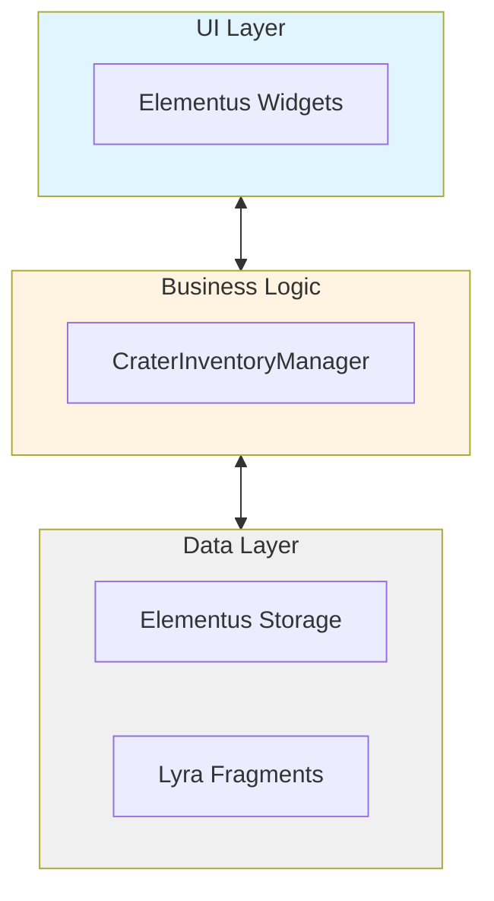

# CraterInventory Documentation Index

Welcome to the **CraterInventory** plugin documentation! This plugin provides a complete inventory and equipment system for Lyra Framework with Gameplay Ability System integration.

---

## 📚 Documentation Files

### 1. [README.MD](./README.MD) - Main Documentation
**For**: Everyone  
**Content**: Complete overview of the system
- Plugin selection and rationale
- Architecture overview
- Integration with Lyra
- Getting started guide
- Usage examples (C++ and Blueprint)
- Key components explained
- Gameplay features (grenades, healing, helmets)
- Network architecture
- What I learned (challenges and solutions)
- Future enhancements
- Backend-authoritative design proposal

**Read this first** if you're new to the plugin.

---

### 2. [QUICKSTART.md](./QUICKSTART.md) - 5-Minute Setup Guide
**For**: Developers who want to get started fast  
**Content**: Step-by-step setup instructions
- Install Elementus Inventory
- Enable plugins
- Add to Experience
- Create your first item
- Create healing ability
- Test in Play
- Common issues and solutions
- Blueprint examples
- Console commands

**Use this** to get the system running in your project quickly.

---

### 3. [ARCHITECTURE.md](./ARCHITECTURE.md) - Technical Deep Dive
**For**: Advanced developers and maintainers  
**Content**: In-depth technical documentation
- System overview and design philosophy
- Component hierarchy
- Data flow diagrams (with ASCII art)
- Class responsibilities
- Network architecture details
- GAS integration internals
- Synchronization and consistency
- Error handling patterns
- Performance considerations
- Extension points
- Debugging tips

**Use this** when you need to understand how everything works under the hood or extend the system.

---

## 🎯 Choose Your Path

### I'm New Here
→ Start with **README.MD**  
→ Then read **QUICKSTART.md**  
→ Come back to **ARCHITECTURE.md** when you need details

### I Want to Use This Right Now
→ Jump to **QUICKSTART.md**  
→ Reference **README.MD** for usage examples  
→ Check **ARCHITECTURE.md** if something doesn't work

### I Need to Extend or Debug This
→ Read **ARCHITECTURE.md** thoroughly  
→ Reference **README.MD** for design rationale  
→ Use **QUICKSTART.md** for testing setup

---

## 🔑 Key Concepts

### Three-Layer Architecture


### Main Components

| Component | Purpose |
|-----------|---------|
| `UCraterInventoryManagerComponent` | Server-authoritative inventory controller |
| `UElementusItemData_LyraIntegration` | Bridge between Elementus and Lyra |
| `UCraterInventoryFragment_Equippable` | Defines equipment behavior (abilities, effects) |
| `UGameFeatureAction_AddComponents` | Injects components via Game Features |

### Key Workflows

1. **Add Item**: UI → Server RPC → Storage Update → Replication → UI Refresh
2. **Equip Item**: UI → Validation → Server RPC → GAS Grant → Replication → UI Refresh
3. **Use Ability**: Input → GAS Activation → Gameplay Effect → Feedback

---

## 📖 Quick Reference

### Adding Items (C++)
```cpp
UCraterInventoryManagerComponent* Inv = 
    UCraterInventoryManagerComponent::FindInventoryManager(PlayerPawn);
Inv->Server_AddItem(FPrimaryElementusItemId(TEXT("Item.HealthPotion")), 5);
```

### Equipping Items (C++)
```cpp
if (Inv->CanEquipItem(SlotIndex, EquipSlot) == ECraterEquipResult::Success)
{
    Inv->Server_EquipItem(SlotIndex, EquipSlot);
}
```

### Listening for Changes (Blueprint)
```
OnInventoryChanged → Refresh UI
OnItemEquipped → Update Equipment Display
OnItemUnequipped → Clear Equipment Display
```

---

## 🔧 Common Tasks

### How do I...

**...create a new item?**
→ See QUICKSTART.md - "Create Your First Item"

**...make an item grant an ability?**
→ See README.MD - "Gameplay Features" section

**...add a stat bonus to equipment?**
→ See README.MD - "Example: Helmet with Stat Bonus"

**...bind UI to inventory changes?**
→ See README.MD - "UI Binding" section

**...debug replication issues?**
→ See ARCHITECTURE.md - "Debugging Tips" section

**...extend the system with new features?**
→ See ARCHITECTURE.md - "Extension Points" section

---

## 🐛 Troubleshooting

| Issue | Solution |
|-------|----------|
| Component not found | Check QUICKSTART.md - "Common Issues" |
| Item won't equip | Check README.MD - Equipment validation |
| Abilities not granted | Check ARCHITECTURE.md - GAS Integration |
| UI not updating | Check README.MD - UI Binding |
| Replication not working | Check ARCHITECTURE.md - Network Architecture |

---

## 📞 Support

### Documentation Issues
If you find errors or unclear sections in the documentation:
1. Check all three docs - the answer might be in another file
2. Review the code comments (extensively documented)
3. Enable verbose logging: `LogCraterInventory VeryVerbose`

### Plugin Issues
1. Check QUICKSTART.md - "Common Issues & Solutions"
2. Enable debug visualization: `showdebug abilitysystem`
3. Check network context: Are you testing with multiple clients?

---

## 📝 Document Structure

```
CraterInventory/
├── README.MD           ← You are here (overview)
├── QUICKSTART.md       ← Fast setup guide
├── ARCHITECTURE.md     ← Technical deep dive
└── Source/
    ├── Public/         ← Header files (extensively commented)
    └── Private/        ← Implementation (with inline docs)
```

---

## 🎓 Learning Path

### Beginner (1-2 hours)
1. Read README.MD introduction
2. Follow QUICKSTART.md setup
3. Create a health potion item
4. Test equipping and using it

### Intermediate (3-4 hours)
1. Read README.MD in full
2. Create weapon with abilities
3. Create armor with stat bonuses
4. Bind UI to inventory events

### Advanced (8+ hours)
1. Read ARCHITECTURE.md thoroughly
2. Extend system with visual equipment
3. Add world item pickup/drop
4. Implement persistence layer

---

## 🚀 Next Steps

After reading the documentation:

1. **Setup**: Follow QUICKSTART.md
2. **Learn**: Read code comments in key classes
3. **Experiment**: Create different item types
4. **Extend**: Add your own fragments and behaviors
5. **Integrate**: Connect with your game's systems

---

## 📚 External Resources

- [Lyra Documentation](https://docs.unrealengine.com/5.0/en-US/lyra-sample-game-in-unreal-engine/)
- [Elementus Inventory Wiki](https://github.com/lucoiso/UEElementusInventory/wiki)
- [Gameplay Ability System](https://docs.unrealengine.com/5.0/en-US/gameplay-ability-system-for-unreal-engine/)
- [Game Features & Modular Gameplay](https://docs.unrealengine.com/5.0/en-US/game-features-and-modular-gameplay-in-unreal-engine/)

---

**Version**: 1.0  
**Last Updated**: 2025-11-28  
**Author**: Anderson  
**Project**: Crater Studios - Multiplayer Extraction Shooter

---

**Happy Coding!** 🎮

