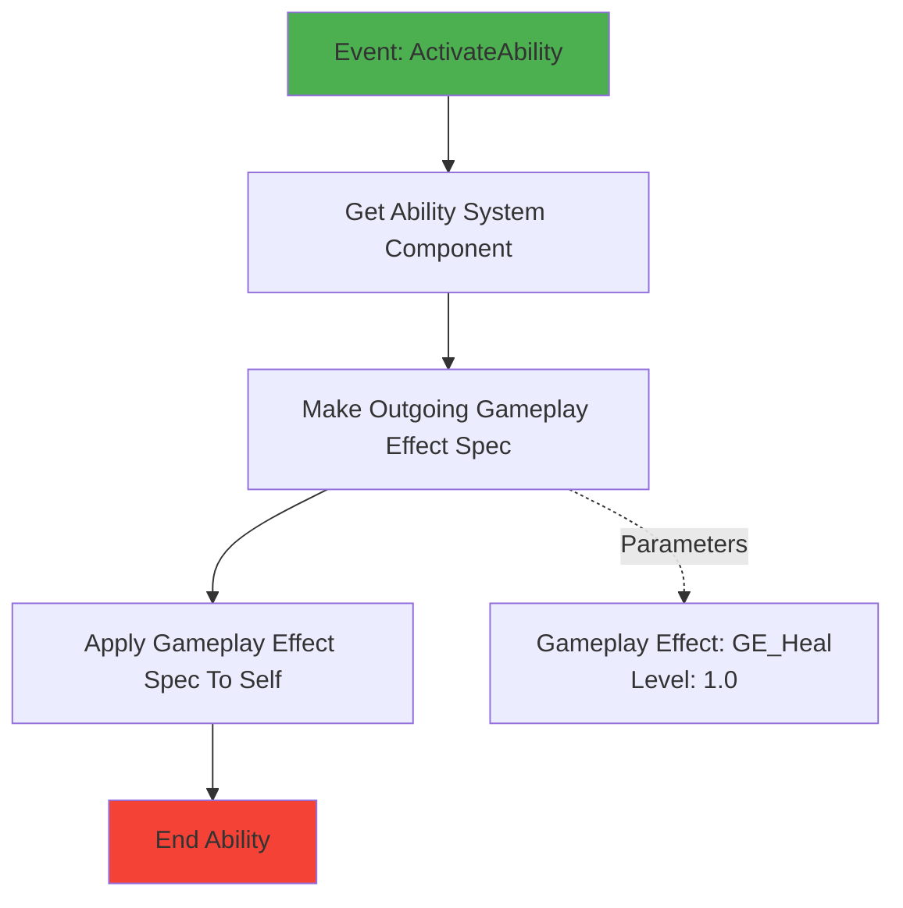
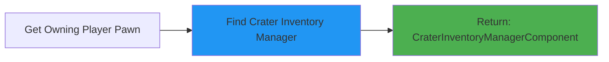
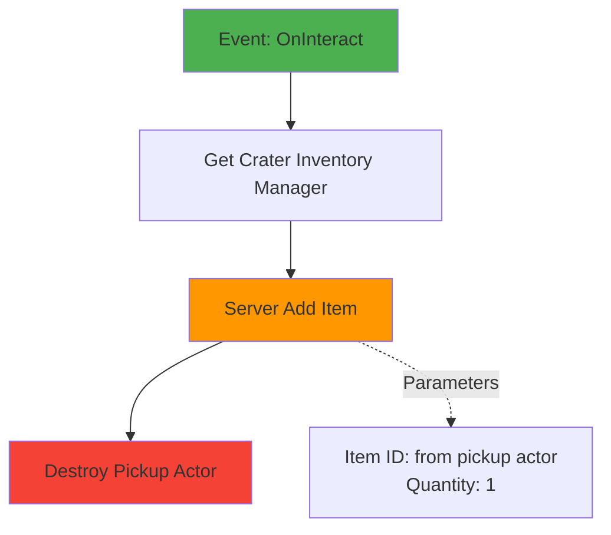
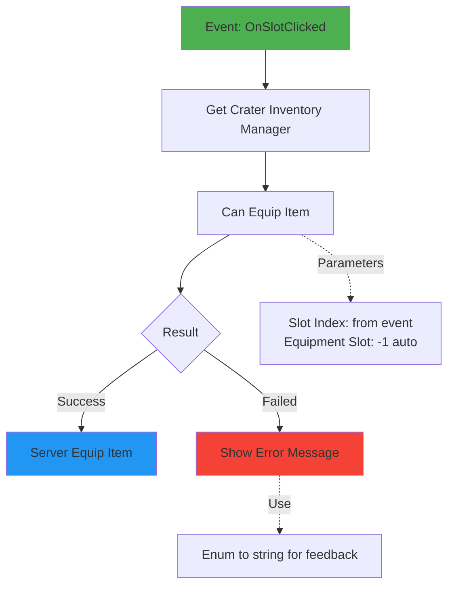

# CraterInventory - Quick Start Guide

## 5-Minute Setup

### Step 1: Install Elementus Inventory
1. Open Epic Games Launcher
2. Go to Unreal Engine Marketplace
3. Search for "Elementus Inventory"
4. Add to Engine (Free)
5. Restart Unreal Editor

### Step 2: Enable Plugins
1. In Unreal Editor: `Edit → Plugins`
2. Search and enable:
   - ✅ `ElementusInventory`
   - ✅ `CraterInventory`
3. Restart Editor

### Step 3: Add to Your Experience
1. Open your Experience Data Asset (e.g., `B_LyraShooterGame_Elimination`)
2. In **Actions** array, add new element
3. Set **Class**: `GameFeatureAction_AddComponents`
4. Add Component Entry:
   - **Actor Class**: `PlayerState` (or `LyraCharacter`)
   - **Component Class**: `CraterInventoryManagerComponent`
   - **Client Component**: ✅ True
   - **Server Component**: ✅ True
5. Add another Component Entry:
   - **Actor Class**: Same as above
   - **Component Class**: `ElementusInventoryComponent`
   - **Client Component**: ✅ True
   - **Server Component**: ✅ True

### Step 4: Create Your First Item

#### 4.1 Create Item Data Asset
1. Right-click in Content Browser
2. `Blueprint Class → ElementusItemData_LyraIntegration`
3. Name it: `ItemData_HealthPotion`
4. Open and configure:
   - **Item Name**: `HealthPotion`
   - **Item Type**: `Consumable`
   - **Item ID**: Type: `Item`, Name: `HealthPotion`
   - **Max Stack Size**: `10`
   - **Can Be Equipped**: ✅ True
   - **Preferred Equipment Slot**: `2` (belt slot)

#### 4.2 Create Lyra Item Definition
1. Right-click in Content Browser
2. `Lyra → Inventory Item Definition`
3. Name it: `ID_HealthPotion`
4. Open and configure:
   - **Display Name**: "Health Potion"
   - Add Fragment: `CraterInventoryFragment_Equippable`

#### 4.3 Configure Equippable Fragment
In `ID_HealthPotion`, select the Equippable fragment:
- **Abilities To Grant**: 
  - Add element → Select `GA_UseHealthPotion` (create this next)
- **Effects To Apply**:
  - (Optional) Add cooldown effect
- **Required Equipment Slot**: `2`
- **Equipped Tags**: Add tag `Item.Equipped.HealthPotion`

#### 4.4 Link Item Data to Definition
Go back to `ItemData_HealthPotion`:
- **Lyra Item Definition**: Select `ID_HealthPotion`

### Step 5: Create Healing Ability (Optional but Recommended)

1. Right-click → `Blueprint Class → LyraGameplayAbility`
2. Name: `GA_UseHealthPotion`
3. Open and add logic:



4. Create Gameplay Effect `GE_Heal`:
   - Right-click → `Gameplay → Gameplay Effect`
   - **Duration Policy**: Instant
   - **Modifiers**:
     - Attribute: `Health`
     - Operation: Add
     - Magnitude: Scalable Float (50.0)

### Step 6: Test in Play

#### Add Item via Console
Press `` ` `` (tilde key) and type:
```
CheatManager.AddItem Item.HealthPotion 5
```

Or create a debug widget/button that calls:
```cpp
UCraterInventoryManagerComponent* Inv = UCraterInventoryManagerComponent::FindInventoryManager(GetOwningPlayerPawn());
Inv->Server_AddItem(FPrimaryElementusItemId(TEXT("Item.HealthPotion")), 5);
```

#### Equip Item
1. Open your inventory UI (Elementus widgets)
2. Drag item to equipment slot #2
3. Check abilities are granted (should see in ASC debug)

#### Use Item
1. Press the ability key (if bound via Input Component)
2. Or activate via ability system

---

## Common Issues & Solutions

### ❌ Component Not Found
**Problem**: `Failed to find CraterInventoryManagerComponent`  
**Solution**: 
- Ensure Game Feature is activated in your Experience
- Check Component Injection is configured correctly
- Verify target actor class matches (PlayerState vs Pawn)

### ❌ Item Not Equipping
**Problem**: `CanEquipItem` returns error  
**Solution**:
- Check `bCanBeEquipped = true` in ItemData
- Verify Lyra Item Definition is referenced
- Ensure Fragment is added to Definition
- Check equipment slot index is valid (0-3 by default)

### ❌ Abilities Not Granted
**Problem**: Item equipped but no abilities  
**Solution**:
- Verify ASC exists on owner
- Check Fragment `AbilitiesToGrant` is populated
- Look for logs: `LogCraterInventory: Granted ability...`
- Ensure owner has valid AbilitySystemComponent

### ❌ UI Not Updating
**Problem**: Inventory changes don't reflect in UI  
**Solution**:
- Bind to `OnInventoryChanged` delegate
- Ensure UI widget references correct component
- Check replication is working (PIE with multiple clients)

---

## Next Steps

1. **Create More Items**: Weapons, armor, consumables
2. **Setup Input Bindings**: Bind abilities to keys (G, Q, E, etc.)
3. **Create UI**: Use Elementus widgets or create custom
4. **Add Visual Equipment**: Attach meshes to character skeleton
5. **Implement World Pickups**: Use Lyra's Interaction system

---

## Useful Console Commands

```
// Add item (if cheat manager method exists)
CheatManager.AddItem <ItemId> <Quantity>

// Show debug for Ability System
showdebug abilitysystem

// Show debug for gameplay tags
showdebug GameplayTags

// Net debug (client/server)
net pktlag 100
net pktloss 5
```

---

## Blueprint Examples

### Get Inventory Component


### Add Item on Pickup


### Equip Item from UI


---

## Performance Tips

1. **Replication**: Uses `COND_OwnerOnly` - efficient for 100+ players
2. **Caching**: ASC is cached on first access
3. **Validation**: Client validates for UX, server validates for authority
4. **Logging**: Use `LogCraterInventory` verbose level in shipping builds

---

## Documentation Links

- **Full README**: See `README.MD` in plugin folder
- **Elementus Docs**: https://github.com/lucoiso/UEElementusInventory/wiki
- **Lyra Docs**: https://docs.unrealengine.com/5.0/en-US/lyra-sample-game-in-unreal-engine/

---

**Happy Coding!** 🎮

