# Crater Inventory System
**Modular Inventory & Equipment Integration for Lyra Framework**

> **Engineering Assignment Submission** - Systems & Gameplay Engineer Position  
> **Author**: Anderson  
> **Date**: November 28, 2025  
> **Project**: Multiplayer Extraction Shooter (Lyra-based)

> 💡 **Note**: This documentation uses [Mermaid](https://mermaid.js.org/) diagrams for better visualization. If viewing on GitHub, diagrams will render automatically. For other viewers, you may need a Mermaid-compatible Markdown viewer.

---

## 📋 Table of Contents
- [Overview](#overview)
- [Plugin Selection & Rationale](#plugin-selection--rationale)
- [Architecture](#architecture)
- [Integration with Lyra](#integration-with-lyra)
- [Getting Started](#getting-started)
- [Usage Guide](#usage-guide)
- [Key Components](#key-components)
- [Gameplay Features](#gameplay-features)
- [Network Architecture](#network-architecture)
- [What I Learned](#what-i-learned)
- [Future Enhancements](#future-enhancements)

---

## 🎯 Overview

The **Crater Inventory System** is a Game Feature plugin that bridges the **Elementus Inventory** system with **Lyra's fragment-based item framework** while integrating the **Gameplay Ability System (GAS)**. This modular solution provides:

- ✅ **Server-authoritative** inventory transactions
- ✅ **Equipment system** with dynamic ability/effect granting
- ✅ **Grid-based UI** for item visualization
- ✅ **GAS integration** for abilities, effects, and tags
- ✅ **Lyra's modular design** patterns (Game Features, Component Manager)
- ✅ **Network-optimized** replication

---

## 🔌 Plugin Selection & Rationale

### Chosen Plugin: **Elementus Inventory**
**Source**: [UE Marketplace (Free)](https://www.unrealengine.com/marketplace/en-US/product/ed47993a6b8a49bdb04dfe83939b6361)

#### Why Elementus?

1. **Data-Driven Architecture**
   - Uses `FPrimaryAssetId` and Asset Manager (same as Lyra)
   - Seamless integration with Lyra's asset management philosophy
   - No runtime conflicts with Lyra's inventory system

2. **Replication Built-In**
   - Handles client-server synchronization automatically
   - Owner-only replication for bandwidth efficiency
   - Eliminates need to rebuild networking from scratch

3. **Grid-Based UI System**
   - Professional drag-and-drop interface
   - Slot-based visualization with stack support
   - Extensible widget architecture

4. **Modular & Non-Invasive**
   - Works as a pure component (no inheritance required)
   - Compatible with Lyra's component-based design
   - Easy to enable/disable via Game Features

5. **Well Documented**
   - Active community support
   - Example projects available
   - Clear API for extension

### What Elementus Provides vs What We Built

| Feature | Elementus | CraterInventory |
|---------|-----------|-----------------|
| Storage & Replication | ✅ Core System | - |
| UI Widgets | ✅ Grid/Slot Widgets | - |
| Item Data Assets | ✅ Base Classes | ✅ Extended with Lyra Integration |
| Equipment System | ❌ Not Included | ✅ **Full Implementation** |
| GAS Integration | ❌ Not Included | ✅ **Abilities, Effects, Tags** |
| Lyra Fragments | ❌ Not Included | ✅ **Fragment System** |
| Authority Model | ✅ Server RPC | ✅ **Enhanced Validation** |

---

## 🏗️ Architecture

### System Layers


### Design Patterns Used

1. **Bridge Pattern**
   - Decouples Elementus storage from Lyra item definitions
   - `UElementusItemData_LyraIntegration` acts as the bridge

2. **Facade Pattern**
   - `UCraterInventoryManagerComponent` provides unified interface
   - Hides complexity of dual-system integration

3. **Observer Pattern**
   - `OnInventoryUpdate` delegate for storage synchronization
   - Reactive updates to equipment state

4. **Authority Pattern**
   - All mutations require `ROLE_Authority`
   - Client requests via Server RPCs
   - Validation before execution

---

## 🔗 Integration with Lyra

### How It Fits Into Lyra's Architecture


### Key Integration Points

#### 1. **Game Feature Plugin**
- Plugin type: `GameFeatures`
- Activation: Experience-driven
- Lifecycle: Managed by `UGameFeatureAction_AddComponents`

#### 2. **Component Injection**
Uses Lyra's `GameFrameworkComponentManager`:
```cpp
// Automatically adds components to PlayerStates/Pawns
ComponentManager->AddComponentRequest(
    APlayerState::StaticClass(), 
    UCraterInventoryManagerComponent::StaticClass()
);
```

#### 3. **Item Data Bridge**
```cpp
UElementusItemData_LyraIntegration
    ├─ Inherits: UElementusItemData (storage)
    └─ References: TSoftClassPtr<ULyraInventoryItemDefinition> (gameplay)
```

#### 4. **Fragment System**
```cpp
UCraterInventoryFragment_Equippable : ULyraInventoryItemFragment
    ├─ AbilitiesToGrant: TArray<TSubclassOf<UGameplayAbility>>
    ├─ EffectsToApply: TArray<TSubclassOf<UGameplayEffect>>
    ├─ EquippedTags: FGameplayTagContainer
    ├─ RequiredTagsToEquip: FGameplayTagContainer
    └─ RequiredEquipmentSlot: int32
```

---

## 🚀 Getting Started

### Prerequisites

1. **Lyra Starter Game** (UE 5.x)
2. **Elementus Inventory Plugin** (installed from Marketplace)
3. **Visual Studio 2022** or **Rider**

### Installation

1. **Enable the Plugin**
   ```
   Edit → Plugins → Search "CraterInventory" → Enable
   ```

2. **Add to Your Experience**
   - Open your Experience Data Asset (e.g., `B_LyraShooterGame_Elimination`)
   - Add action: `GameFeatureAction_AddComponents`
   - Configure component injection:
     - **Actor Class**: `APlayerState` or `ALyraCharacter`
     - **Component Class**: `UCraterInventoryManagerComponent`
     - **Client Component**: ✅ True
     - **Server Component**: ✅ True

3. **Configure Elementus**
   - Add `UElementusInventoryComponent` to your PlayerState/Pawn
   - Set inventory size, max stack, etc. in component defaults

4. **Create Item Data**
   - Right-click in Content Browser
   - `Blueprint Class → ElementusItemData_LyraIntegration`
   - Configure:
     - Item ID (e.g., `Weapon.Sword`)
     - Lyra Item Definition (reference your fragment-based asset)
     - Can Be Equipped: ✅ True

5. **Create Item Definitions**
   - Right-click → `Lyra → Inventory Item Definition`
   - Add fragment: `CraterInventoryFragment_Equippable`
   - Configure abilities, effects, tags

---

## 📖 Usage Guide

### Basic Inventory Operations

#### Adding Items (Blueprint)
```blueprint
Get Crater Inventory Manager (from PlayerState)
    ↓
Server Add Item
    • Item ID: "Weapon.IronSword"
    • Quantity: 1
```

#### Adding Items (C++)
```cpp
UCraterInventoryManagerComponent* Inventory = 
    UCraterInventoryManagerComponent::FindInventoryManager(PlayerPawn);

if (Inventory)
{
    FPrimaryElementusItemId ItemId(TEXT("Weapon.IronSword"));
    Inventory->Server_AddItem(ItemId, 1);
}
```

### Equipment System

#### Equipping Items (Blueprint)
```blueprint
Get Crater Inventory Manager
    ↓
Can Equip Item
    • Slot Index: 0 (inventory slot)
    • Equipment Slot: 0 (or -1 for auto)
    ↓
[If Success] Server Equip Item
```

#### Equipping Items (C++)
```cpp
// Validate first
ECraterEquipResult Result = Inventory->CanEquipItem(SlotIndex, EquipmentSlot);
if (Result == ECraterEquipResult::Success)
{
    // Equip to specific slot
    Inventory->Server_EquipItem(SlotIndex, EquipmentSlot);
    
    // Or auto-select slot
    Inventory->Server_EquipItem(SlotIndex, AUTO_EQUIP_SLOT);
}
```

#### Unequipping Items
```cpp
Inventory->Server_UnequipItem(EquipmentSlot);
```

### Querying Inventory State

#### Get All Items
```cpp
TArray<FElementusItemInfo> Items = Inventory->GetInventoryItems();
for (const FElementusItemInfo& Item : Items)
{
    UE_LOG(LogTemp, Log, TEXT("Item: %s, Qty: %d"), 
        *Item.ItemId.ToString(), Item.Quantity);
}
```

#### Get Equipped Items
```cpp
TArray<FCraterEquippedItemEntry> Equipped = Inventory->GetEquippedItems();
for (int32 i = 0; i < Equipped.Num(); ++i)
{
    if (Equipped[i].IsValid())
    {
        UE_LOG(LogTemp, Log, TEXT("Slot %d: %s"), 
            i, *Equipped[i].ItemInfo.ItemId.ToString());
    }
}
```

#### Check if Item is Equipped
```cpp
bool bEquipped = Inventory->IsItemEquipped(InventorySlotIndex);
```

### UI Binding

#### Listen for Changes
```cpp
// In your UI widget
void UMyInventoryWidget::NativeConstruct()
{
    Super::NativeConstruct();
    
    UCraterInventoryManagerComponent* Inventory = GetInventoryManager();
    if (Inventory)
    {
        Inventory->OnInventoryChanged.AddDynamic(this, &ThisClass::RefreshUI);
        Inventory->OnItemEquipped.AddDynamic(this, &ThisClass::HandleItemEquipped);
        Inventory->OnItemUnequipped.AddDynamic(this, &ThisClass::HandleItemUnequipped);
    }
}
```

---

## 🔑 Key Components

### UCraterInventoryManagerComponent
**Purpose**: Server-authoritative inventory controller and equipment manager

**Key Responsibilities**:
- Transaction management (add, remove, swap, discard)
- Equipment slot management
- GAS integration (grant/revoke abilities)
- Storage synchronization
- Network replication

**Key Methods**:
| Method | Authority | Description |
|--------|-----------|-------------|
| `Server_AddItem` | Server RPC | Add items to inventory |
| `Server_RemoveItem` | Server RPC | Remove items by ID |
| `Server_DiscardItem` | Server RPC | Remove items from slot |
| `Server_SwapItems` | Server RPC | Swap two inventory slots |
| `Server_EquipItem` | Server RPC | Equip item from inventory |
| `Server_UnequipItem` | Server RPC | Unequip item to inventory |
| `CanEquipItem` | Both | Validation check |
| `GetInventoryItems` | Both | Query all items |
| `GetEquippedItems` | Both | Query equipment |

### UElementusItemData_LyraIntegration
**Purpose**: Data asset bridge between Elementus and Lyra

**Key Properties**:
```cpp
UPROPERTY(EditAnywhere)
TSoftClassPtr<ULyraInventoryItemDefinition> LyraItemDefinition;

UPROPERTY(EditAnywhere)
bool bCanBeEquipped = false;

UPROPERTY(EditAnywhere)
int32 PreferredEquipmentSlot = -1;
```

**Key Methods**:
- `LoadLyraDefinitionSync()`: Synchronously load Lyra definition
- `FindLyraFragment<T>()`: Template method to find fragments
- `HasLyraDefinition()`: Check if item has Lyra integration

### UCraterInventoryFragment_Equippable
**Purpose**: Lyra fragment defining equippable behavior

**Configuration**:
```cpp
UPROPERTY(EditDefaultsOnly)
TArray<TSubclassOf<UGameplayAbility>> AbilitiesToGrant;

UPROPERTY(EditDefaultsOnly)
TArray<TSubclassOf<UGameplayEffect>> EffectsToApply;

UPROPERTY(EditDefaultsOnly)
int32 RequiredEquipmentSlot = -1;  // -1 = any slot

UPROPERTY(EditDefaultsOnly)
FGameplayTagContainer EquippedTags;

UPROPERTY(EditDefaultsOnly)
FGameplayTagContainer RequiredTagsToEquip;

UPROPERTY(EditDefaultsOnly)
FGameplayTagContainer BlockingTagsToEquip;
```

### UGameFeatureAction_AddComponents
**Purpose**: Game Feature action for component injection

**How It Works**:
1. Registers component requests with `GameFrameworkComponentManager`
2. Components are added when target actors spawn
3. Non-destructive injection (no inheritance required)
4. Automatically cleaned up when feature deactivates

---

## 🎮 Gameplay Features

### Dynamic Ability Granting

When an item is equipped:
1. **Lyra instance created** from item definition
2. **Fragments queried** for equippable data
3. **Abilities granted** to owner's ASC
4. **Effects applied** with source context
5. **Tags added** to ASC

When unequipped:
1. **Abilities revoked** via stored handles
2. **Effects removed** via active handles
3. **Tags removed** via stored container

### Example: Grenade Belt

**Item Setup**:
```cpp
// In CraterInventoryFragment_Equippable
AbilitiesToGrant:
  - GA_ThrowGrenade (input-bound to 'G' key)

RequiredEquipmentSlot: 2  // Belt slot
```

**Ability Implementation**:
```cpp
// GA_ThrowGrenade.cpp
void UGA_ThrowGrenade::ActivateAbility(...)
{
    // 1. Play throw animation
    // 2. Spawn grenade projectile
    // 3. Apply cooldown
    // 4. Consume item charge (if implemented)
}
```

### Example: Healing Item

**Item Setup**:
```cpp
// In CraterInventoryFragment_Equippable
AbilitiesToGrant:
  - GA_UseHealthKit

EffectsToApply:
  - GE_HealthKit_Cooldown (duration-based cooldown)
```

**Ability Implementation**:
```cpp
void UGA_UseHealthKit::ActivateAbility(...)
{
    // 1. Check if on cooldown
    // 2. Apply healing effect
    // 3. Play feedback (VFX, SFX)
    // 4. Trigger cooldown
}
```

### Example: Helmet with Stat Bonus

**Item Setup**:
```cpp
// In CraterInventoryFragment_Equippable
EffectsToApply:
  - GE_Helmet_MovementSpeedBonus

EquippedTags:
  - Equipment.Helmet.Equipped
  - Protection.Head

RequiredEquipmentSlot: 0  // Head slot
```

**Gameplay Effect**:
```cpp
// GE_Helmet_MovementSpeedBonus
Duration: Infinite
Modifiers:
  - Attribute: MovementSpeed
  - Operation: Multiply
  - Magnitude: 1.10 (+10%)
```

---

## 🌐 Network Architecture

### Authority Model


### Replication Strategy

1. **Storage Replication**: Handled by Elementus
   - `COND_OwnerOnly` for bandwidth efficiency
   - Automatic delta compression

2. **Equipment Replication**: Handled by CraterInventory
   - `UPROPERTY(ReplicatedUsing = OnRep_EquippedItems, ReplicationCondition = COND_OwnerOnly)`
   - Efficient struct replication

3. **GAS Replication**: Handled by Lyra/GAS
   - Abilities: Replicated via ASC
   - Effects: Replicated via active effect handles
   - Tags: Replicated via ASC tag container

### Server-Client Flow

#### Item Pickup Flow


#### Equipment Flow


---

## 📚 What I Learned

### Lyra Architecture Insights

1. **Experience System**
   - Experiences are the entry point for feature activation
   - Game Feature Actions define what gets loaded
   - Component injection is preferred over inheritance

2. **Component-Based Design**
   - `GameFrameworkComponentManager` enables modular composition
   - Components can be added/removed at runtime
   - No need to modify base classes

3. **Item System Philosophy**
   - Definitions are blueprints (templates)
   - Instances are runtime objects (unique state)
   - Fragments provide modular functionality

4. **Network Model**
   - Server authority is non-negotiable
   - RPCs for requests, replication for state
   - Owner-only replication for player-specific data

### Integration Challenges & Solutions

#### Challenge 1: Dual Storage Systems
**Problem**: Elementus and Lyra both have inventory concepts  
**Solution**: Bridge pattern - Elementus for storage/UI, Lyra for gameplay

#### Challenge 2: Equipment State Synchronization
**Problem**: Items can move in storage, breaking equipment slot references  
**Solution**: Track by ItemId instead of slot index, rebuild mapping on updates

#### Challenge 3: GAS Lifecycle Management
**Problem**: Abilities/effects must be cleaned up on unequip  
**Solution**: Store handles in equipment entry, revoke on unequip/destroy

#### Challenge 4: Fragment Access
**Problem**: Elementus items don't natively support fragments  
**Solution**: Created `UElementusItemData_LyraIntegration` bridge class

### Best Practices Discovered

1. **Validation Everywhere**
   - Client validates for UI feedback
   - Server validates for authority
   - Use enum result codes for specific feedback

2. **Guard Clauses**
   - Check validity early, return fast
   - Reduces nesting, improves readability

3. **Logging Strategy**
   - Separate log categories (Inventory, Data, UI)
   - Log network context (Client/Server/ListenServer)
   - Verbose for debugging, Display for important events

4. **Replication Efficiency**
   - Use `COND_OwnerOnly` for player-specific data
   - Replicate structs instead of individual properties
   - Let Elementus handle storage replication

---

## 🔮 Future Enhancements

### Planned Features

1. **World Item Interaction**
   - Use Lyra's `UInteractionComponent`
   - Spawn world item actors on drop
   - Pickup from world to inventory

2. **Visual Equipment System**
   - Attach meshes to character skeleton
   - Show equipped weapons/armor
   - Hide/show based on equipment state

3. **Persistent Storage**
   - Save inventory to database/save game
   - Restore on login/respawn
   - Backend-authoritative item creation

4. **Advanced Stacking**
   - Durability system
   - Item quality/rarity
   - Unique item instances with stat rolls

5. **Crafting System**
   - Recipe-based item creation
   - Material consumption
   - Crafting station interaction

### Backend-Authoritative Design (Extraction Shooter)

#### System Requirements
- ✅ Server owns all item data
- ✅ Client never creates items
- ✅ Persistent item database
- ✅ Secure loot generation
- ✅ Match-based item extraction

#### Architecture Proposal

```mermaid
graph TB
    subgraph Backend["Backend Services"]
        ItemSvc["Item Service"]
        LootSvc["Loot Service"]
        MatchSvc["Match Service"]
    end
    
    subgraph GameServer["Game Server (UE)"]
        ServerInv["UServerInventoryService<br/>(Spawned on DS only)"]
        Note1["• Fetches player stash from backend<br/>• Validates item operations<br/>• Generates loot from loot tables<br/>• Commits extracted items post-match"]
    end
    
    subgraph ClientLayer["Client"]
        ClientNote["• Displays items (read-only authority)<br/>• Sends requests (equip, use, drop)<br/>• Receives state updates"]
    end
    
    Backend <-->|REST/gRPC| GameServer
    GameServer <-->|Replication| ClientLayer
    
    style Backend fill:#4CAF50
    style GameServer fill:#2196F3
    style ClientLayer fill:#FF9800
```



#### Key Classes

```cpp
// Server-only service (spawned by GameMode)
UServerInventoryService
  ├─ LoadPlayerStash(PlayerId) → Backend API call
  ├─ SavePlayerStash(PlayerId) → Backend API call
  ├─ GenerateLoot(LootTableId) → Server-side RNG
  ├─ ValidateTransaction(ItemId, Operation) → Cheat prevention
  └─ CommitExtractedItems(MatchId, PlayerId, Items) → Post-match persistence

// Match-scoped inventory (temporary)
UMatchInventoryComponent : UCraterInventoryManagerComponent
  ├─ bAllowStashAccess (false during match)
  ├─ ExtractedItems (items marked for extraction)
  └─ OnMatchEnd() → Trigger commit to stash

// Persistent stash (out-of-match only)
UStashInventoryComponent : UCraterInventoryManagerComponent
  ├─ bReadOnly (true during match)
  └─ LoadFromBackend(PlayerId)
```

#### Data Flow: Extraction Match

1. **Pre-Match**: Load stash from backend
2. **Match Start**: Initialize match inventory (empty or from stash loadout)
3. **During Match**: All loot generated server-side from tables
4. **Extraction Trigger**: Mark items as "extracted"
5. **Match End**: Commit extracted items to backend
6. **Post-Match**: Update stash inventory, replicate to client

---

## 📞 Support & Contact

**Author**: Anderson  
**Role**: Systems & Gameplay Engineer Candidate  
**Project**: Crater Studios - Multiplayer Extraction Shooter

### Documentation References
- [Lyra Documentation](https://docs.unrealengine.com/5.0/en-US/lyra-sample-game-in-unreal-engine/)
- [Elementus Inventory Wiki](https://github.com/lucoiso/UEElementusInventory/wiki)
- [Gameplay Ability System](https://docs.unrealengine.com/5.0/en-US/gameplay-ability-system-for-unreal-engine/)
- [Game Features & Modular Gameplay](https://docs.unrealengine.com/5.0/en-US/game-features-and-modular-gameplay-in-unreal-engine/)

---

## 📄 License

This plugin is part of a technical assignment submission for Crater Studios.  
For educational and evaluation purposes.

---

**Thank you for reviewing this submission!** 🚀

